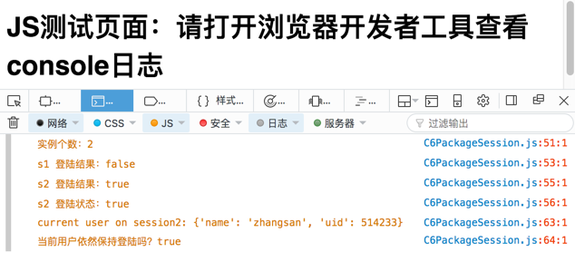

# 从``java``到``javascript``的快速入门

本文专门为学过C语言的Java程序员，快速理解javascript语言的重要概念，量身定做。笔者对javascript其他实现面向对象的方式，尽可能保持克制，尽可能让javascript的面向对象风格与java对标起来，帮助java程序员快速掌握javascript面向对象。

之所以有必要讲解下``javascript``，是因为如今的``javascript``是全能（全栈）的，除了运行于浏览器；还可以借助``node``运行到服务器；还可以借助``electron``这类框架，开发桌面程序；还可以``React-Native``，开发手机程序；还有在类似``cassandra``服务器里面用``javascript``做嵌入式脚本语言。类似这样的变化，还在不断发生。

文章用到的代码均托管在 [github](https://github.com/downgoon/java2javascript) 的 [downgoon/java2javascript](https://github.com/downgoon/java2javascript) 上，可通过[issue](https://github.com/downgoon/java2javascript/issues)给我反馈 。

<!-- TOC depthFrom:1 depthTo:6 withLinks:1 updateOnSave:1 orderedList:0 -->

- [从``java``到``javascript``的快速入门](#从java到javascript的快速入门)
	- [1. 从函数开始](#1-从函数开始)
		- [弱类型](#弱类型)
		- [``function``关键字](#function关键字)
		- [函数指针与调用运算符](#函数指针与调用运算符)
		- [优先运算符](#优先运算符)
		- [匿名函数](#匿名函数)
		- [匿名函数的立即调用](#匿名函数的立即调用)
	- [2. 插播JS对象](#2-插播js对象)
		- [对象定义](#对象定义)
		- [属性读取](#属性读取)
		- [属性追加](#属性追加)
		- [属性遍历](#属性遍历)
	- [3. 对象与函数纠缠](#3-对象与函数纠缠)
		- [对象的属性是一个函数](#对象的属性是一个函数)
		- [返回对象的函数](#返回对象的函数)
		- [返回函数的函数](#返回函数的函数)
		- [函数嵌套另一个函数](#函数嵌套另一个函数)
	- [4. 闭包](#4-闭包)
		- [封装](#封装)
		- [继承](#继承)
	- [5. 面向对象](#5-面向对象)
		- [模板与实例](#模板与实例)
		- [静态成员与静态方法](#静态成员与静态方法)
		- [类的继承](#类的继承)
	- [6. 包命名空间](#6-包命名空间)
	- [7. 回归总结](#7-回归总结)

<!-- /TOC -->

## 1. 从函数开始

要实现一个``sumlen``函数，输入两个字符串，返回它们的长度之和。``java``代码（完整代码见[C1Sumlen.java](code/C1Sumlen.java)）是这样的：

``` java
// 函数定义
int sumlen(String x, String y) {
  return x.length() + y.length();
}

// 函数调用
int sl = sumlen("hello", "world");
```

相比较``javascript``代码（完整代码见[C1Sumlen.js](code/C1Sumlen.js)）是这样的：

``` js
// 函数定义
function sumlen(x, y) {
  return x.length + y.length;
}

// 函数调用
var sl = sumlen("hello", 'world');
```

两者的相似与差异正如它们的名字（据说``javascript``当初叫这个名字也正是想借一下``java``的势头）：
- 相似处：语法上很像。
- 差异处：（1）JS是弱类型，Java是强类型；（2）JS函数需要``function``关键字，Java无需。

### 弱类型

JS不像Java那样，定义变量x的时候，要指定数据类型是``String``，``Boolean``或``Integer``。JS形式上都是``var``（类似Java的``Object``是一切类的``超类``），只不过当它赋值后，就隐含了数据类型（可用系统``typeof``函数查看）。如下详细代码见[C1JsType.js](code/C1JsType.js):

``` js
var x;  // 类型 undefined
x = 'helloworld';  // 类型 string
x = 3.14;  // 类型 number
x = true;  // 类型 boolean
x = ['helloworld', 3.14, true];   // 属性 数组Object
```

### ``function``关键字

正因为JS是弱类型，于是定义函数的时候，函数签名时的输入参数和输出参数就没必要都带个``var``了，这样代码（详细见[C1JsFunc.js](code/C1JsFunc.js)）更简洁：

``` js
// 无输入，无输出
function f_in0_ou0() {
    console.log('无输入，无输出');
}

// 无输入，有输出
function f_in0_ou1() {
    return 'helloworld';
}

// 有输入，有输出
function f_in1_ou1(x) {
    return x.length;
}

// 有输入，无输出
function f_in0_ou1() {
    return Math.random();
}
```

### 函数指针与调用运算符

``弱类型``谈到无论是布尔类型，数字类型还是字符串类型都可以赋值给``var``。在JS中，``function``也是一种类型，它也可以赋值给``var``变量，这点非常类似C语言的函数指针或说Java语言的``interface``。详细代码见[C1JsFuncPointer.js](code/C1JsFuncPointer.js)：

``` js
function sumlen(x, y) {
    return x.length + y.length;
};

var f = sumlen; // 函数赋值给变量（类似函数指针）

sumlen('hello', 'world');  //  按函数名称调用
f('hello', 'world');  // 按函数指针调用
```

``f('hello', 'world');`` 语法就是在``函数指针``后面加一个``()``调用运算符，就表示调用。

### 优先运算符

函数指针后面的``()``是``调用运算符``。实际上我们还可以在函数指针前面加``()``，表示``优先运算符``。例如：

``` js
f('hello', 'world');  // 按函数指针调用
(f)('hello', 'world');  // 函数指针加了一个 优先运算符
((f))('hello', 'world');  // 加2个优先运算符
```

它就类似算数运算表达式： ``1*2+3*4`` 也可更加清楚的写为  ``(1*2)+(3*4)``。


### 匿名函数

``` js
var g = function (x, y) {
    return x.length + y.length;
}
console.log('匿名函数： ' + g('hello', 'world'));
```

JS的函数，还可以不用起名字，用``function``声明后，立即赋值给一个变量（如果不赋值给一个变量，以后就没法调用了）。这种不起名字的函数就叫``匿名函数``。

### 匿名函数的立即调用

前面我们看到，函数可以赋值给一个变量（函数指针），然后通过函数指针可以调用函数：

``` js
var f = sumlen;  // 函数赋值给变量
f('hello', 'world');  // 按函数指针调用
```

也提到如果是匿名函数定义，必须赋值给一个变量，不然以后没有调用``句柄``。但是我们有没有想过，如果定义的时候，就立即调用呢？这样不就不需要调用句柄么？答案：的确可以。

``` js
(function (x, y) {
    console.log('匿名函数的立即调用：' + x + ',' + y);
    return x.length + y.length;
})('hello', 'world');
```

这个匿名函数是带两个输入参数的，也可以不带输入参数的：

``` js
(function() {
    console.log('不带参数的匿名函数的立即调用');
})();
```

上述结构是这样的：

- 匿名函数：``function() {}``
- 匿名函数调用：先用了一个``优先运算符``，把函数优先起来，``(function(){})``；接着使用``调用运算符``，``(function(){})()``。

## 2. 插播JS对象

### 对象定义

前面谈了JS的函数，还没完，但我们先放一放。插播下JS对象。对Java程序员来说，JS对象不会陌生，它非常类似JSON数据（因为JSON就是从JS来的），具体代码详见[C2JsObj.js](code/C2JsObj.js)：

``` js
var x = {'name': 'zhangsan', 'age': 25, 'male': true};
```

当然，为了方便，JS还允许它写成如下格式（属性名可以不用引号）：

``` js
var x = {name: 'zhangsan', age: 25, male: true};
```

### 属性读取

如果要引用它的属性呢？下面两种方式都可以：

``` js
x.name   // 很像Java的public成员，也像C的结构体成员
x['name']   // 居然还可以类似Java的Map
```

恐怕让Java程序员吃惊的是对象的属性还可以``x['name']``引用。其实Java也可以的，只不过是要用``反射``机制。
自此JS的变量，可以被赋值以下各种类型：

``` js
var x;
x = 3.14;
x = `helloworld`;
x = true;
x = function() {};
x = {'name': 'zhangsan', 'age': 25, 'male': true};
```

### 属性追加

JS对象还有个特点，它可以随时追加属性。比如上面的人除了姓名、年龄和性别外，我们还可以加一个学历信息：

``` js
x.edu = 'master';
console.log(x); // 它输出： { name: 'zhangsan', age: 25, male: true, edu: 'master' }
```

对Java程序员看来，JS对象，有点像Class类new出来的对象，又有点像Map这种字典类或者是基于反射的类，可以随时加属性。

### 属性遍历

如果要遍历对象``x``下的所有属性，可以类似Java的Map遍历一样：

``` js
for (var f in x) {
    console.log(f);
}
```

## 3. 对象与函数纠缠

有了``函数``和``对象``的基本知识，我们接着看看它们之间的纠缠组合。详细代码见[C3FuncObj.js](code/C3FuncObj.js)

### 对象的属性是一个函数

刚才的``var x = {name: 'zhangsan', age: 25, male: true};``，对象的属性都是普通类型的数据，而对象属性本质上就是一个变量，这个变量既可指向普通数据，也可指向另一个对象，还可以指向一个函数。

``` js
var x = {
    name: 'zhangsan',
    age: 25,
    male: true,
    selfIntro: function() {
        console.log('我叫'+this.name+',今年'+this.age+'岁，性别'+(this.male?'男':'女'));
    },
    sayHi: function() {
        console.log("Hello, World");
    },
    parents: [
        {'name': 'wangyi', 'age': 42},
        {name: 'maliu', 'age': 40}
    ]
};

console.log(x.selfIntro); // 打印出函数
x.selfIntro();
x.sayHi();
```

这里的``sayHi``属性和``selfIntro``属性都指向一个匿名函数；而``parents``属性指向一个对象数组。

**注意**
>在``selfIntro``方法中，为了访问name等属性，还使用到了``this``关键字，表示本对象的引用。

### 返回对象的函数

截止目前，我们之前讲的函数，要么没有返回值，要么返回的只是普通数据。这里我们要在一个函数调用后，返回一个对象：

``` js
function Person() { // 函数名称的首字母故意大写
    return {'name': 'zhangsan', 'age': 25, 'male': true};
};

var p1 = Person(); // 函数调用第一次，返回一个对象
var p2 = Person(); // 函数调用第二次，返回第二个对象
console.log(p1==p2); // 打印false，表示的确是两个不同对象
```

代码``var p1 = Person();``，完全是函数的一次调用，只不过这个函数的首字母大写了，就会马上让Java程序员联想到``Person p1 = new Person();``。我们还可以引入3个输入变量，把``Person``函数改写下：

``` js
function Person(name, age, male) {
    return {'name': name, 'age': age, 'male': male};
};
```

### 返回函数的函数

前面的章节，大家感受到在JS里``函数``也是个对象，可以赋值给``var x``。那么我们有没有想过，如果一个函数的返回值是另外一个函数呢？

``` js
function Person(n, a, m) { // 函数的输入参数
    var name = n;
    var age = a;  // 定义局部变量（函数内的）
    var male = m;

    return function() { // 函数的返回值是一个匿名函数
        return '我叫'+name+',今年'+age+'岁，性别'+(male?'男':'女');
    };
};

var pSelfIntro = Person('chenliu', 36, true);
console.log(pSelfIntro());
```

这段代码是一个名叫``Person``的函数，它有点特别的是函数调用后的返回值不是普通数据，而是一个匿名函数（当然这个匿名函数的返回值是一个组合字符串）。语句``var pSelfIntro = Person('chenliu', 36, true);``是把函数调用的结果（一个匿名函数）赋值给了一个``pSelfIntro``变量，这个变量后面接一个``()``调用运算符，实现调用，并把调用结果用console输出。

### 函数嵌套另一个函数

刚才的例子，返回值是一个函数的时候，其实也意味着在JS中，一个函数的内部还可以定义另外一个函数。也就是``函数嵌套``。
上述返回函数的函数改写下，以便更清晰地展现函数嵌套的概念：

``` js
function PersonOuter(n, a, m) {
    var name = n;
    var age = a;  // 定义局部变量（函数内的）
    var male = m;

    function PersonInner() { // 函数嵌套
        return '我叫'+name+',今年'+age+'岁，性别'+(male?'男':'女');
    };

    return PersonInner; // 函数的返回值是一个带名函数
};

var innerFunc = PersonOuter('chenliu', 36, true);
innerFunc(); // 函数调用
```

我们可以看到，在内部函数可以访问外部函数的变量。再来[C3FuncObj-nestfun.js](code/C3FuncObj-nestfun.js)：

``` js
var outer_var = 1;
function outer_fun() { // 外层函数定义
    var midd_var = 2;
    function inner_fun() { // 内层函数定义
        var inner_var = 3;
        console.log(outer_var + midd_var + inner_var);
        function core_fun() { // 核层函数定义
            var core_var = 4;
            console.log(outer_var + midd_var + inner_var + core_var);
        };
        core_fun(); // 核层函数调用
    };
    inner_fun(); // 内层函数调用
};
outer_fun(); // 外层函数调用
```

这个例子简单来说，就是说明了JS函数可以嵌套定义，并且内层可以访问外层的变量（包括父节点和祖先节点）。

## 4. 闭包

### 封装

有了前面这么多铺垫后，我们可以讲解JS的一个比较费解的概念``闭包``。
假设我们要实现一个SDK，它用来登陆一个网站，它需要给各个子系统共享，以便减少大家的重复开发。但是需要考虑避免全局变量等的冲突。我们期望的使用代码是这样的：

``` js
var passed = PassportSDK.login('guest', 'guest');
console.log('登陆结果：' + passed); // 输出 false

passed = PassportSDK.login('admin', '123456');
console.log('登陆结果：' + passed); // 输出 true
console.log('失败次数：' + PassportSDK.getFailCount()); // 输出 1 （因为曾今失败过一次）
console.log('已经登录？：' + PassportSDK.isLogined()); // 输出 true （当前是登陆状态）
console.log(PassportSDK.dbPwd); // 报错，试图访问私有成员
```

那么实现代码是：

``` js
var PassportSDK = (function() { // 匿名函数

    // 扮演私有成员：函数的内部变量
    var dbUser = 'admin'; // 数据库账号
    var dbPwd = '123456'; // 数据库密码

    var failCnt = 0; // 存储失败次数
    var status = false; // 记录登陆状态

    // 扮演公开方法：函数的返回值
    // 返回值是一个对象，对象的有些属性是一个函数
    return {

        login: function(user, password) {
            var isPassed = (dbUser == user && dbPwd === password);
            if (! isPassed) {
                failCnt ++;
            } else {
                status = true;
            }
            return isPassed;
        },

        getFailCount: function() {
            return failCnt;
        },

        isLogined: function() {
            return status;
        }

    };

})(); // 匿名函数的立即调用

```

怎么解释下这段代码呢？有了前面的铺垫，我们可以这么解释：
>- ``闭包``是匿名函数的立即调用；
>- 调用的返回值是一个对象；
>- 对象的某些属性是一个函数。

如果您是javascript新手，请反复琢磨这句话，并用这句话解读``PassportSDK``代码，您一定会有所悟。

``闭包``有什么好处呢？
>- 名字空间：它好比Java的package机制。比如``PassportSDK.login``方法不会跟其他的``login``引发名字冲突。
>- 私有变量：函数嵌套中的内部变量，按道理内部函数执行完后，就会释放掉；但是因为函数把内部变量``植入``到另一个对象，当做返回值返出去了，导致一方面不能直接访问（发挥``私有成员``的效果了），另一方面变量还没有释放（因为被包裹着作为返回值了）。

### 继承

刚才的``闭包``实现了名字空间，还实现了私有成员。但是Java的面向对象还有继承，假如我们要在``开闭原则``下，拓展``PassportSDK``，加入一个``logout``方法呢？期望使用：

``` js
PassportSDKExt.login('admin', '123456'); // 复用 PassportSDK 的实现
PassportSDKExt.logout(); // 增加新的功能
```

实现代码如下：

``` js
var PassportSDKExt = (function(parent) {

    parent.logout = function() { // 对象可以动态追加属性
        parent.status = false; // 访问不了私有成员，没有Java的Protected概念
    };

    return parent;

})(PassportSDK); // PassportSDK 是之前的变量
```

上述代码就是直接利用了对象可以动态可以``追加属性``的机制。当然同样是用了匿名函数的立即调用，只不过这个匿名函数有一个输入参数，所以立即调用时，需要把``PassportSDK``当做输入参数传递进去。

但是这个代码实际上无法运行，因为``parent.status``是访问不了的，它没有Java的``protected``成员的概念（子类可以访问）。


## 5. 面向对象

### 模板与实例

上面的方式我们都采用了 **匿名函数的立即调用** 这种形式。但这种形式有个问题，只能在定义的时候调用一次，后面再想调用就调用不了。有点类似Java设计模式里面的``单例模式``。但面向对象，应该有``类``这种``模板``机制，``类``每次调用构造方法都能构建一个新的``对象``。为了能多次调用，我们可以把匿名函数改成命名函数。本实例完整代码见 [C5Session.js](code/C5Session.js)

在改成命名函数前，为了更加符合``RESTful``风格，我们把上面``PassportSDK``的名字重构一下，``login``和``logout``分别重构为``session.create``与``session.remove``，因为从资源与资源操作的角度看，登陆的本质就是在服务端分配了一个``session``资源，登出就是回收``session``资源。

- 名称重构

重构后的 ``匿名函数的立即调用`` 形式：

``` js
var session = (function () { // 匿名函数的立即调用
    var status = false;  // 私有成员
    return {
        create: function (name, pwd) { // 公有方法
            status = ('admin' == name && '123456' == pwd);
            return status;
        },
        remove: function () { // 公有方法
            status = false;
        },
        isActive: function () { // 公有方法
            return status;
        }
    };
})();

session.create('guest', 'guest'); // 使用
```

- 改成命名函数

``` js
var Session = function () { // 命名函数
    var status = false;  // 私有成员
    return {
        create: function (name, pwd) { // 公有方法
            status = ('admin' == name && '123456' == pwd);
            return status;
        },
        remove: function () { // 公有方法
            status = false;
        },
        isActive: function () { // 公有方法
            return status;
        }
    };
};

var session = Session(); // 命名函数的调用
session.create('guest', 'guest'); // 使用
```

改成命名函数后，如果想“构造一个对象”，可以执行``var session = Session();``，但这种风格总跟Java有点不习惯，Java需要一个``new``关键字，比如：``Session session = new Session();``。但是Java领域，Factory模式都不太主张在使用方直接用``new``了，因为那样是强耦合，设计模式里倡导的风格是``Session session = sessionFactory.newInstance();``，而且最近几年开始流行``Vertx vertx = Vertx.vertx()``这种风格（Java的一个叫``vertx.io``的框架中有很多这种风格）。``Vertx.vertx()`` 这种风格，如果换到javascript里面，也是非常容易实现的，它就是``Vertx``对象，有个叫``vertx``的属性，这个属性是一个函数。于是我们再改写一下：

- ``Vertx.vertx()``风格

``` js
var Session = {
  session: ${上面的命名函数}
};

var session = Session.session();
session.create('guest', 'guest');
```

完整的代码：

``` js
var Session = { // Vertx.vertx() 风格
  session: function () { // ${上面的命名函数}
      var status = false;  // 私有成员
      return {
          create: function (name, pwd) { // 公有方法
              status = ('admin' == name && '123456' == pwd);
              return status;
          },
          remove: function () { // 公有方法
              status = false;
          },
          isActive: function () { // 公有方法
              return status;
          }
      };
  };
};

var session = Session.session();
session.create('guest', 'guest');
```

到这，模板就是``Session``，构造实例就是``Session.session()``，跟Java就非常吻合了。利用闭包，也有了类似``status``属性的私有成员；通过返回对象，对象的属性是一个函数的形式，有了公有方法。

### 静态成员与静态方法

如果我们把上面的``Session``比作是Java的类，那么``Session.session()``就好比是静态方法。如果我们需要一个静态成员，来记录实例的个数呢？

``` js
var Session = {
  instanceCount: 0, // 类的静态成员 （无法私有化）
  session: function () { // 类的静态方法
      Session.instanceCount ++; // 调用Session.session() 后，实例数+1
      var status = false;  // 实例的私有成员
      return {
          create: function (name, pwd) { // 实例的公有方法
              status = ('admin' == name && '123456' == pwd);
              return status;
          }
      };
  },
  getInstanceCount: function() { // 类的静态方法
    return Session.instanceCount; // 只是对标Java风格，实际instanceCount并非私有
  }
};

var session = Session.session();
Session.getInstanceCount();
```

### 类的继承

``类的继承``依然可以用前面讲过的方式：

``` js
var SessionSub = {
    sessionSub: (function(parent) { // 这段代码前面讲过
        parent.currentUser = function() {
          return '{}';
        }
        return parent;
    })(Session); // 把超类作为参数
};

SessionSub sessionSub = SessionSub.sessionSub();
sessionSub.currentUser();
```

## 6. 包命名空间

前面我们讲闭包的时候，提到了它类似Java的package机制。现在我们把前面的``闭包``和这里的面向对象（实际上这里面也是有``闭包``，只是我们前面自己把``闭包``的定义弄成了以``匿名函数的立即调用``为前提，主要是为了初级接触时，能记住和理解，对概念咬文嚼字，笔者认为没有太必要，毕竟使用javascript是一种技能，并非一种理论）组合起来运用，详细代码见[C6PackageSession.js](code/C6PackageSession.js)。

以下我们定义一个``package``，名字叫``io_example_passport``，它下面有两个类：``Session``与``User``：

``` js
var io_example_passport = (function () { // 依然是匿名函数的立即调用
    return {
        Session: { // 类似Java的类
            instanceCount: 0, // 类的静态成员 （无法私有化）
            session: function () { // 类的静态方法
                Session.instanceCount++; // 调用Session.session() 后，实例数+1
                var status = false;  // 实例的私有成员
                return {
                    create: function (name, pwd) { // 实例的公有方法
                        status = ('admin' == name && '123456' == pwd);
                        return status;
                    },
                    isActive: function() {
                        return status;
                    }
                };

            },

            getInstanceCount: function () { // 类的静态方法
                return Session.instanceCount; // 只是对标Java风格，实际instanceCount并非私有
            }
        },

        User: { // 类似Java的类
            user: function(session) { // 带参数的构造函数
                var priSession = session; // 私有成员
                var user = {};
                user.getUser = function () {
                    if (priSession.isActive) {
                        return "{'name': 'zhangsan', 'uid': 514233}";
                    } else {
                        throw 'Please login first';
                    }
                };
                user.getSession = function () {
                    return priSession;
                };
                return user;
            }
        }
    }

})();
```

如何使用上面的代码呢？跟Java还是比较相似的：

``` js
// Session类
var Session = io_example_passport.Session;
var session1 = Session.session();
var session2 = Session.session();
console.log('实例个数：' + Session.getInstanceCount());
var s1Passed = session1.create('guest', 'guest');
console.log('s1 登陆结果：' + s1Passed);
var s2Passed = session2.create('admin', '123456');
console.log('s2 登陆结果：' + s2Passed);
console.log('s2 登陆状态：' + session2.isActive());


// User 类
var User = io_example_passport.User;
var user = User.user(session2);
var currentUser = user.getUser();
console.log('current user on session2: ' + currentUser);
console.log('当前用户依然保持登陆吗？' + user.getSession().isActive());
```

运行结果：

``` bash
$ node C6PackageSession.js
实例个数：2
s1 登陆结果：false
s2 登陆结果：true
s2 登陆状态：true
current user on session2: {'name': 'zhangsan', 'uid': 514233}
当前用户依然保持登陆吗？true
```

虽然这里是通过``node C6PackageSession.js``来运行的，其实您也可以通过浏览器运行，用浏览器直接打开[C6PackageSession.html](code/C6PackageSession.html)即可。



## 7. 回归总结

本文重点讲解了javascript的函数与对象的特点，并由它们的相互纠缠（即：返回对象的函数，返回函数的函数，对象属性是一个函数）引出了``闭包``的概念。我们把``闭包``不严谨的定义为：``匿名函数的立即调用；调用返回的是一个对象；对象的某些属性是一个函数。``，然后再由匿名函数的一次调用的缺陷，重构成命名函数，``Vertx.vertx()``风格，从而实现了类似Java的面向对象。最后，把闭包和面向对象再组合了一次，引入了``package``命名空间机制。

当然javascript是发展的，关于模块化与面向对象的机制，还有``prototype``机制，还有``ES6``直接从语言层面引入了类机制。另外一个是，借助``webpack``这种工具，可以更好的模块化，然后“编译”生成一个单一的js文件。您完全没有听错，当项目规模大的时候，为了更好的模块化，即便是javascript动态脚本语言，都需要类似Java语言一样去“编译”（可能的工作包括把多个JS文件合并成一个JS文件；也可以用类JS语言写，比如CoffeJS，然后翻译成纯JS；还可以压缩最小化等）。
