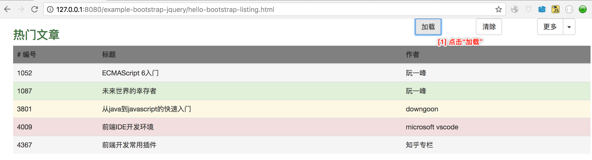
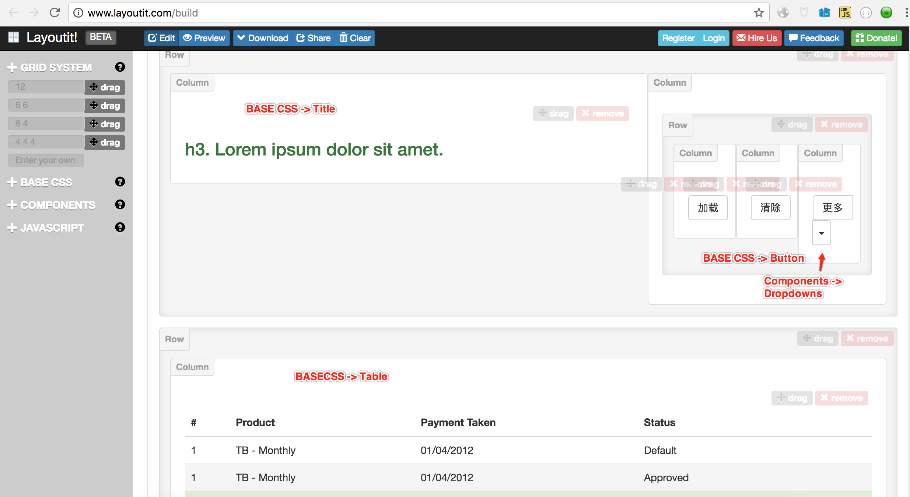
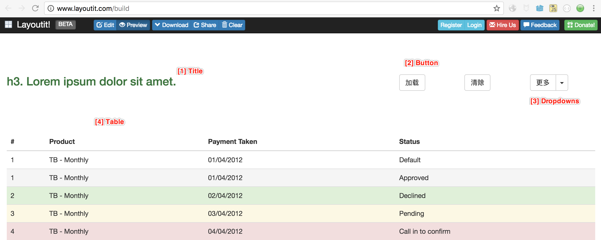

# 基于``bootstrap``和``jQuery``开始前端编程

<!-- TOC depthFrom:1 depthTo:6 withLinks:1 updateOnSave:1 orderedList:0 -->

- [基于``bootstrap``和``jQuery``开始前端编程](#基于bootstrap和jquery开始前端编程)
	- [实验需求描述](#实验需求描述)
	- [后端API服务器](#后端api服务器)
	- [基于bootstrap制作页面](#基于bootstrap制作页面)
		- [bootstrap 简介](#bootstrap-简介)
		- [生成实验页面](#生成实验页面)
		- [其他辅助工具](#其他辅助工具)
	- [jQuery](#jquery)
		- [通用AJAX请求](#通用ajax请求)
		- [jQuery选择器](#jquery选择器)
		- [jQuery 操作DOM](#jquery-操作dom)
	- [如何运行](#如何运行)
		- [启动 REST API服务](#启动-rest-api服务)
		- [启动页面服务器](#启动页面服务器)

<!-- /TOC -->

## 实验需求描述

从一个``RESTful API``服务器，拉取``/posts``的JSON信息，展现在一个HTML的Table里面。



如上图所示，当点击“加载”按钮后，会从后端读取JSON数据，并展示在列表中（不同行显示不同的样式）。

## 后端API服务器

前端需要利用AJAX去后端拉取数据，所以我们得有个后端服务器提供``RESTful API``服务：

- API服务器：有个提供JSON API的后端服务器。这里推荐 [json-server](https://www.npmjs.com/package/json-server) 来快速构建想要的API服务，不需要数据库，一条命令行就构建了CRUD操作。
- 页面服务器：写出来的页面都加载到浏览器中运行，浏览器一般请求Web服务器把页面加载起来。这里推荐 [http-server](https://www.npmjs.com/package/http-server)，随时随地一条命令行就把Web服务器启动了，比``nginx``方便很多。

先安装它们：

``` bash
$ npm install -g json-server
$ npm install -g http-server
```

构建API服务：

- 创建``db.json``文件

``` json
{
  "posts": [
    { "id": 1, "title": "json-server", "author": "typicode" }
  ],
  "comments": [
    { "id": 1, "body": "some comment", "postId": 1 }
  ],
  "profile": { "name": "typicode" }
}
```

这个文件相当于关系型数据库。拉取数据请求：

``` bash
$ curl -X GET -i http://localhost:3000/posts

[
  {
    "id": 1,
    "title": "json-server",
    "author": "typicode"
  }
]
```

-------

## 基于bootstrap制作页面

### bootstrap 简介

``bootstrap``是``twitter``的一个开源项目，用来做响应式页面的。什么叫响应式页面呢？其实就是设备自适应页面，在PC大屏幕浏览时，能用；在手机小屏幕时就会自动变化，适应小屏幕。它的生态很繁荣，比如有人基于它，写了拖拽式页面生成器：[layoutit](http://www.layoutit.com/build)，它的中文版 [layoutit CN](http://www.layoutit.cn/) 。

这个``layoutit``工具主要提供这几个东西：

- ``Grid System``: 基于栅格的布局系统。每一行分成12份，这12份单位如何分配呢？可以只分1份，就是“通栏”；分2份，可以“6-6分”，也可以“8-4”分，当然我们也可以自定义为“2-10”分；分3份，即“4-4-4”分；当然，也可以分12份，就是“1-1-1-1-1-1-1-1-1-1-1-1”。``Grid``里面可以 **嵌套**，也就是一行分若干列，在某个列里面，还可以继续分若干列。

- ``Base CSS``: 基本CSS组件。比如表单``Form``，按钮``Button``，列表``Ordered/Unordered List`` 和 ``Table``等。

- ``Components``: 更为复杂的组件。下拉按钮``Button Dropdowns``。

### 生成实验页面



整体布局，用了两个``Row``：第二行是一个通栏，里面只放了一个``Table``；第一行是一个“8-4”分的两栏，其中第2列，**进行了嵌套**，再细分了3列（它是"4-4-4"分的）。拖拽完后，我们可以“预览”并“下载”它。



最终的页面见：[example-bootstrap-jquery/hello-bootstrap-listing.html](example-bootstrap-jquery/hello-bootstrap-listing.html)

**注意**
>下载下来的页面，不是完整的HTML页面，只有Body部分。我们可以从“菜鸟教程网”找一个``bootstrap``样例，并把body替换掉。比如：[菜鸟教程网的BootStrap 缩略图样例](http://www.runoob.com/bootstrap/bootstrap-thumbnails.html)。

``` html
<!DOCTYPE html>
<html>
<head>
	<meta charset="utf-8">
    <title>Bootstrap 实例 - 缩略图</title>
	<link rel="stylesheet" href="http://cdn.static.runoob.com/libs/bootstrap/3.3.7/css/bootstrap.min.css">
	<script src="http://cdn.static.runoob.com/libs/jquery/2.1.1/jquery.min.js"></script>
	<script src="http://cdn.static.runoob.com/libs/bootstrap/3.3.7/js/bootstrap.min.js"></script>
</head>
<body>
  <!-- 替换掉 body  -->
</body>
<html>
```

### 其他辅助工具

- HTML插件：在``vscode``中，安装``HTML Boilerplate``插件，以便生成HTML模板。
- 菜鸟教程的HTML模板：在菜鸟教程网中直接选一个样例，然后点击``尝试一下``在线使用。比如：http://www.runoob.com/jquery/jquery-ajax-get-post.html

---------

## jQuery

前端工作很多一部分可以概括为：从后端服务器拉取点数据，然后在页面上展现一下。拉取数据，需要用到``ajax``操作，展现数据，需要用到``DOM``操作，这两个操作都可以借助``jQuery``完成。

### 通用AJAX请求

``ajax``通用请求：

``` javascript
$("#btnLoad").click(function () {
    $.ajax({
        url: 'http://localhost:3000/posts',
        type: 'GET',
        async: true,
        success: function (data) { // 请求成功时的异步回调
            if (data != null && data.length > 0) {
                $(".table tbody").empty(); // remove previous items
                for (i = 0; i < data.length; i++) {
                    console.info('a[%d]=%s', i, JSON.stringify(data[i])); // 调试日志
                    var trow = "";
                    trow = trow.concat('<tr class="').concat(rowStyle(i)).concat('">');
                    trow += ('<td>' + data[i].id + '</td>');
                    trow += ('<td>' + data[i].title + '</td>');
                    trow += ('<td>' + data[i].author + '</td>');
                    trow += '</tr>';

                    $(".table tbody").append(trow); // DOM 操作
                }
                $(".table thead").css("background-color", "gray"); // table header
            }
        }
    });
});
```

除此之外，还有：``GET``，``POST``和``Load``请求。

- [load样例](http://www.runoob.com/jquery/jquery-ajax-load.html)
- [get和post样例](http://www.runoob.com/jquery/jquery-ajax-get-post.html)

### jQuery选择器

``jQuery``选择器，跟``CSS``的语法是一样的：用``.class``表示``class``选择；用``#id``表示``id``选择；用元素名选择元素，比如``button``就选择按钮元素。

当然它还可以支持“层次选择”，类似我们行政区域的“浙江省 杭州市”这种。

``` javascript
$(".table thead").css("background-color", "gray"); // table header
```

表示对``class``为``table``的元素下的``thead``类型的元素，并把它的背景色样式设置为灰色。被选中的HTML是：

``` html
<div class="col-md-12">
    <table class="table">
        <thead>
          <tr><th># 编号</th><th>标题</th></tr>
        </thead>
        ...
</div>
```

### jQuery 操作DOM

- 追加元素

``` javascript
$(".table tbody").append(trow); // DOM 操作
```

- 修改样式

``` javascript
$(".table thead").css("background-color", "gray"); // table header
```

## 如何运行

### 启动 REST API服务

``` bash
$ cd java2javascript/restapi
$ json-server db.json
```

此时可以在浏览器访问：http://localhost:3000/posts

### 启动页面服务器

``` bash
$ cd java2javascript
$ http-server .
```

然后在浏览器中访问：http://localhost:8080/example-bootstrap-jquery/hello-bootstrap-listing.html
